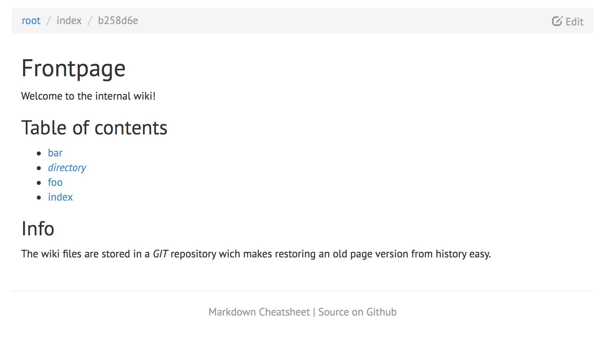

# go-pages

A wiki tool built on golang with git as the storage back-end. Content
is formatted in [markdown
syntax](https://github.com/adam-p/markdown-here/wiki/Markdown-Cheatsheet). The wiki is
rendered with go templates and [bootstrap](http://getbootstrap.com) css but doesn't depend on any CDN.
This project was forked from [aspic/g-wiki](https://github.com/aspic/g-wiki).

## Using

Simply go get it:

	go get github.com/jpxd/go-pages

Run it with

	go-pages

Available command line flags are:

* -address=:8080 *(in the format ip:port, empty ip binds to all ips)*
* -dir=files *(data directory has to be an intialized git repository!)*
* -title=CoolWiki *(title for the wiki)*

## Extensions

You can call extension methods from markdown content like `{{ extensionName param1 ... }}`.
For a list of available extensions, see below.

### Available Extensions

#### Tree

`{{ tree }}` generates a flat map of the current directories files and subdirectories.

`{{ tree anysubdir }}` generates a flat map of the files and subdirectories in *anysubdir*.

Depth and subdir params can be combined.

## Example screenshot

